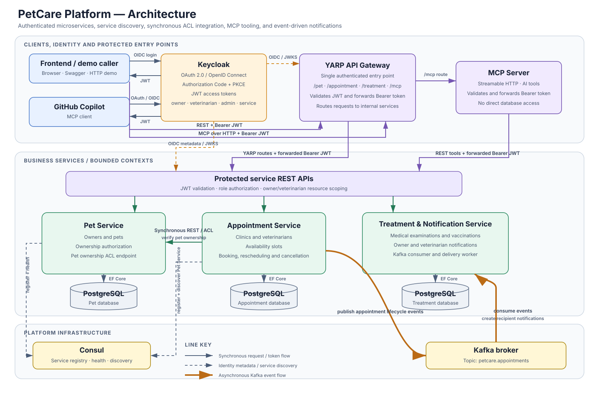
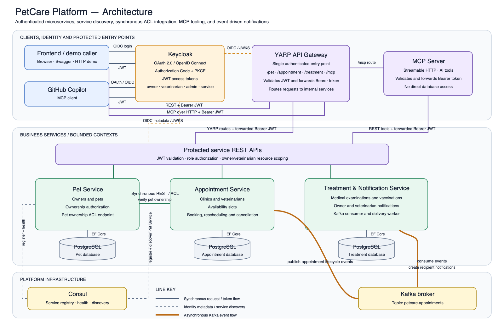

# PetCare Platform

PetCare Platform is a three-member course project built as three business microservices:

| Member | Service | Responsibility |
|---|---|---|
| 1 | Pet Service | Owners, pets, ownership verification |
| 2 | Appointment Service | Clinics, veterinarians, slots, appointments |
| 3 | Treatment Service | Examinations, vaccinations, Kafka notifications, MCP integration |

The API Gateway, Keycloak, Consul, Kafka, MCP server, frontend, tests, and documentation are shared platform responsibilities. They do not count as additional business microservices.

## Architecture


### Архитектурен дијаграм



[Отвори и преземи](docs/architecture/index.html) · [Editable SVG](docs/architecture/petcare-platform-architecture.svg) · [PNG export](docs/architecture/petcare-platform-architecture.png)

## 3. Domain-Driven Design




Runtime source is grouped under `src/`, while verification code and generated contracts live under `tests/`:

```text
src/
├── Services/
│   ├── PetService/
│   ├── AppointmentService/
│   └── TreatmentService/
├── Platform/
│   ├── ApiGateway/
│   └── MCPServer/
├── Frontend/
└── Shared/
tests/
├── Contracts/pacts/
├── EndToEnd/
└── *.Tests/
```

Every business service uses the same `Api`, `Application`, `Domain`, and `Infrastructure` layout and owns its PostgreSQL database.

The main integrations are:

- YARP protects the REST service routes; the deliberately trusted `/mcp` route is anonymous.
- Keycloak issues user JWTs plus client-credentials tokens for Appointment and the privileged MCP service account.
- Appointment resolves Pet Service through Consul and calls its ownership ACL endpoint.
- Appointment publishes lifecycle events to Kafka.
- Treatment consumes the events idempotently and creates owner/veterinarian notifications.
- Pact verifies the Appointment consumer/Pet provider HTTP contract.
- MCP exposes service functionality without direct database access.

## Components and ports

| Component | Host URL/port |
|---|---|
| Frontend | `http://localhost:5173` |
| API Gateway and Swagger | `http://localhost:7000` |
| MCP through Gateway | `http://localhost:7000/mcp` |
| MCP direct | `http://localhost:7001/mcp` |
| Pet Service | `http://localhost:5101` |
| Appointment Service | `http://localhost:5102` |
| Treatment Service | `http://localhost:5103` |
| Keycloak | `http://localhost:8080` |
| Consul UI | `http://localhost:8500` |
| Kafka host listener | `localhost:29092` |
| Pet / Appointment / Treatment PostgreSQL | `5433` / `5434` / `5553` |

## Start the platform

Requirements: Docker Desktop with Compose. .NET 10 and Node.js 22 are only needed for local builds.

```powershell
docker compose up -d --build
docker compose ps
```

Open the frontend at `http://localhost:5173` or Gateway Swagger at `http://localhost:7000/swagger`.

Demo users:

| Username | Password | Role |
|---|---|---|
| `owner1` | `Owner123!` | owner |
| `vet1` | `Vet123!` | veterinarian |
| `admin1` | `Admin123!` | admin |

These are development-only credentials. Docker Compose also contains development client secrets; replace them outside a local demo.

Stop the platform while keeping database volumes:

```powershell
docker compose down
```

Reset all demo database data:

```powershell
docker compose down -v
```

## Verify the complete workflow

With the stack running, execute:

```powershell
pwsh -File tests/EndToEnd/verify-docker-workflow.ps1
```

The script proves this production path:

1. `owner1` logs in through Keycloak.
2. The seeded pet Luna is read through the Gateway.
3. An open Appointment slot is selected.
4. Appointment obtains a Keycloak client-credentials token.
5. Appointment resolves Pet Service through Consul and verifies ownership.
6. The appointment is stored and a Kafka event is published.
7. Treatment consumes the event and creates a notification.

Expected final output includes an Appointment ID and a Kafka notification ID.

## Test MCP with an MCP-capable app

The easiest UI test is Visual Studio Code with GitHub Copilot Agent mode. A ready-to-copy configuration is stored in `src/Platform/MCPServer/mcp.json`. Keep it there as the project template and add its contents to the VS Code user MCP configuration so the repository does not need a root `.vscode` folder.

1. Start the Docker stack.
2. In VS Code, run **MCP: Open User Configuration** from the Command Palette.
3. Copy the `servers.petcare` configuration from `src/Platform/MCPServer/mcp.json` into the opened user `mcp.json`. Merge it if that file already contains other MCP servers.
4. Run **MCP: List Servers**, select `petcare`, and start it.
5. Open Copilot Chat in Agent mode, enable the PetCare tools, and try:
   - `Get the pet with id 44444444-4444-4444-4444-444444444444.`
   - `List open appointment slots.`
   - `Show upcoming appointments for owner 33333333-3333-3333-3333-333333333333.`

The MCP endpoint intentionally performs no caller authentication. It obtains a Keycloak client-credentials token for the privileged `mcp-server` service account and supplies explicit owner and veterinarian IDs from tool arguments when an operation is user-specific. Treat ports `7000` and `7001` as trusted local-development endpoints: anyone who can reach `/mcp` can read or change any data exposed by its tools.

The server currently exposes 13 tools:

- Pet: `get_pet`, `get_owner_pets`
- Appointment: `find_available_veterinarians`, `get_upcoming_appointments`, `search_clinics`, `search_available_slots`, `find_open_appointment_slots`, `create_available_slot`
- Treatment: `get_medical_history`, `get_vaccination_history`, `get_next_vaccination`, `record_medical_examination`, `record_vaccination`

Other MCP-capable applications can use the same Gateway URL, `http://localhost:7000/mcp`, without an authorization header.

VS Code MCP setup reference: <https://code.visualstudio.com/docs/agent-customization/mcp-servers>

## Build and test locally

Run every .NET test project:

```powershell
dotnet restore PetCarePlatform.slnx
dotnet test PetCarePlatform.slnx --no-restore
```

Build the frontend:

```powershell
cd src/Frontend
npm ci
npm run build
```

Important test groups include domain tests, application tests, repository tests, API integration tests, Kafka/PostgreSQL integration tests, Gateway tests, MCP protocol/end-to-end tests, and consumer/provider Pact tests. Generated contracts are stored in `tests/Contracts/pacts/`.

## Configuration

Docker Compose supplies all runtime addresses and development secrets. Standard ASP.NET double-underscore environment variables override `appsettings.json`, for example:

- `ConnectionStrings__Database`
- `Jwt__Authority`, `Jwt__Issuer`, `Jwt__Audience`
- `Consul__Address`
- `Kafka__BootstrapServers`
- `ServiceAuthentication__ClientId`, `ServiceAuthentication__ClientSecret`

The Appointment-to-Pet call always uses the real integration. There is no production fake switch. Test doubles exist only inside test projects.

## Documentation and health

- Gateway Swagger: `http://localhost:7000/swagger`
- Pet Swagger: `http://localhost:5101/swagger`
- Appointment Swagger: `http://localhost:5102/swagger`
- Treatment Swagger: `http://localhost:5103/swagger`
- Health endpoints: `/health` on Gateway, MCP, and every service
- Editable architecture source: `docs/architecture/petcare-platform-architecture.svg`

The notification sender intentionally writes to the service console for the course demo; email/SMS delivery is outside the project scope.
