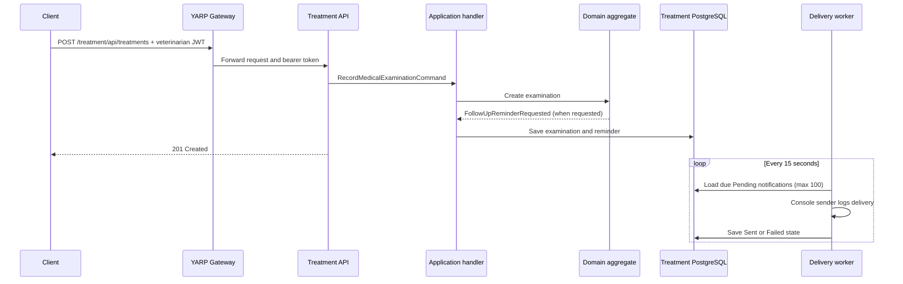
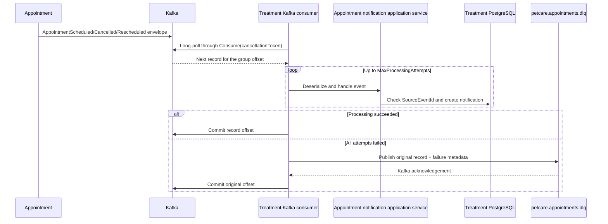

# Treatment & Notification Service

The Treatment & Notification Service owns PetCare's clinical records, vaccination records, and appointment-derived notifications. It is an independent bounded context: it owns its PostgreSQL schema, never reads another service's database, consumes appointment lifecycle events from Kafka, and exposes its own REST API.

Member 3 owns this service together with the shared MCP server and API Gateway integration.

## Responsibilities and scope

The service is responsible for:

- recording medical examinations and optional follow-up reminders;
- recording vaccinations and optional next-dose reminders;
- returning medical and vaccination histories;
- returning the next due vaccination;
- consuming appointment scheduled, cancelled, and rescheduled events;
- creating one notification for each unique source event;
- delivering due notifications through a structured console log;
- protecting HTTP operations with Keycloak JWT authentication and role authorization.

The following are deliberate non-goals for this course project:

- an e-mail provider;
- an SMS provider;
- placeholder e-mail/SMS adapters;
- a `GetPendingNotifications` endpoint.

The console sender is the completed demo delivery adapter. Notification history remains available through `GET /api/notifications/owner/{ownerId}`; no provider account or external secret is needed to demonstrate the workflow.

## Architecture and DDD boundaries

The project follows the same layered structure used by the other PetCare services:

| Layer | Responsibility | Main examples |
| --- | --- | --- |
| Domain | Clinical rules, notification state, value objects, domain events, repository contracts | `MedicalExamination`, `Vaccination`, `Notification`, `Diagnosis`, `VaccinationSchedule` |
| Application | Commands, queries, DTO mapping, orchestration, appointment-event handling | record examination/vaccination handlers, history handlers, reminder handlers |
| Infrastructure | PostgreSQL repositories, EF Core mappings, Kafka consumer, console delivery | `TreatmentDbContext`, `AppointmentEventConsumer`, `NotificationDeliveryProcessor` |
| API | HTTP contracts, authentication/authorization, OpenAPI, error mapping | treatment, vaccination, and notification controllers |

Dependencies point inward: domain code does not depend on ASP.NET Core, EF Core, Kafka, or the API. Infrastructure implements domain repository contracts, while API composition in `Program.cs` selects the concrete adapters.

### Domain model

`MedicalExamination` is the aggregate for a completed clinical examination. It requires pet, owner, and veterinarian identifiers, an examination time, a valid `Diagnosis`, and a valid `TreatmentPlan`. It normalizes medication input and permits an optional future control date. When a control date exists, it raises `FollowUpReminderRequested`.

`Vaccination` records a vaccine, administration date, optional next due date, veterinarian, owner, pet, and batch. `VaccinationSchedule` enforces that a next due date is after administration. A next due date raises `VaccinationReminderRequested`.

`Notification` is an idempotent scheduled-delivery aggregate. New notifications start in `Pending` and may transition exactly once to `Sent` or `Failed`. `SourceEventId` identifies the cause of a notification. Its unique database index is the final concurrency guard against duplicate Kafka deliveries or duplicate commands.

Important value objects are:

- `Diagnosis` and `TreatmentPlan`, which prevent invalid empty clinical text;
- `VaccineName` and `VaccinationSchedule`, which enforce vaccination rules;
- `NotificationContent`, which validates title and message;
- `SourceEventId`, which normalizes and validates idempotency keys.

## Request and reminder flow



The application saves the examination/vaccination and its domain-event reminder through the same scoped `TreatmentDbContext`. The database unique index on `SourceEventId` prevents two reminders from representing the same cause.

## Kafka consumer flow

Appointment Service publishes `IntegrationEventEnvelope` messages to `petcare.appointments`. The envelope contains the event type, serialized payload, occurrence time, and correlation/event identifier. The Treatment hosted consumer subscribes as consumer group `treatment-notification-service`.



### Why this is reliable

- `EnableAutoCommit` is disabled. An offset is committed only after database processing succeeds.
- If processing fails before commit, Kafka may redeliver the record. That is intentional at-least-once delivery.
- `SourceEventId` is checked before insert and has a unique index, making replay idempotent.
- Processing is retried a configured number of times.
- A permanently invalid record is published to the dead-letter topic before its original offset is committed, so it cannot block every later event in the partition.
- If dead-letter publication itself fails, the original record remains uncommitted and replayable.
- Shutdown is cooperative: the application cancellation token unblocks `Consume`, closes the consumer, and exits the hosted service.

Kafka polling is efficient because `Consume` delegates to the Confluent client, which uses Kafka's long-polling protocol. The broker keeps a fetch pending until data is available or the broker-side wait expires; the application does not run a busy CPU loop.

### Consumed event behavior

| Event | Notification type | Delivery schedule |
| --- | --- | --- |
| `AppointmentScheduledEvent` | `AppointmentScheduled` | One day before the appointment, or immediately when that time has passed |
| `AppointmentCancelledEvent` | `AppointmentCancelled` | Immediately |
| `AppointmentRescheduledEvent` | `AppointmentRescheduled` | Immediately |

## Notification delivery worker

`NotificationDeliveryWorker` is registered with `AddHostedService`, so the host creates one worker instance and invokes `ExecuteAsync` once for the application lifetime. That method contains the cancellation-aware loop and waits 15 seconds between cycles.

Each cycle creates a dependency-injection scope and calls `NotificationDeliveryProcessor`. The processor:

1. queries at most 100 due `Pending` notifications;
2. invokes `INotificationSender` for each notification;
3. marks successful deliveries `Sent` with a UTC timestamp;
4. marks individual delivery exceptions `Failed` with a bounded failure reason;
5. continues the rest of the batch after an individual failure;
6. persists all changed states once per non-empty batch.

Cancellation is never converted into a failed notification. It propagates so application shutdown stays fast and correct. The processor uses `TimeProvider`, which makes time-dependent behavior deterministic in unit tests.

The final `ConsoleNotificationSender` writes notification type, ID, owner, title, and message through structured `ILogger` output. This provides visible evidence in Docker logs without introducing external providers that are unrelated to the course architecture requirements.

## REST API

Direct Docker host URL: `http://localhost:5103`  
Gateway URL prefix: `http://localhost:7000/treatment`

| Method and path | Required role | Result |
| --- | --- | --- |
| `GET /api/treatments/pet/{petId}` | any authenticated user | Medical history, newest first |
| `POST /api/treatments` | `veterinarian` or `admin` | Records an examination; returns `201` |
| `GET /api/vaccinations/pet/{petId}` | any authenticated user | Vaccination history, newest first |
| `GET /api/vaccinations/pet/{petId}/next` | any authenticated user | Closest upcoming vaccination or `404` |
| `POST /api/vaccinations` | `veterinarian` or `admin` | Records a vaccination; returns `201` |
| `GET /api/notifications/owner/{ownerId}` | `owner`, `admin`, or `service` | Notification history, newest first |
| `POST /api/notifications` | `admin` or `service` | Creates an idempotent notification; returns `201` or `409` |
| `GET /health` | anonymous | Liveness response |
| `GET /swagger` | anonymous | Swagger UI |
| `GET /openapi/v1.json` | anonymous | OpenAPI document with bearer scheme |

Malformed domain input is returned as RFC-style `ProblemDetails` with status `400`. A duplicate notification source returns `409`. Missing/invalid authentication returns `401`, while a valid token without the required role returns `403`.

## Security

In Docker, JWT metadata and signing keys are loaded from Keycloak at the internal authority `http://keycloak:8080/realms/petcare`. Tokens presented by host clients use issuer `http://localhost:8080/realms/petcare` and audience `petcare`. The service validates issuer, audience, signature, and lifetime.

Keycloak realm and client roles are converted to ASP.NET role claims by `KeycloakRoleClaimsTransformation`. YARP and MCP forward the original bearer token; the Treatment API remains the final authorization boundary for its own data and write operations.

The symmetric development signing key and legacy Appointment `/auth` endpoints exist only for isolated local tests/development. The Docker demonstration uses real Keycloak tokens.

## MCP and Gateway integration

The shared MCP server does not access this database. `TreatmentServiceClient` calls the REST API and forwards the caller's bearer token. Treatment tools are:

- `get_medical_history`
- `get_vaccination_history`
- `get_next_vaccination`
- `record_medical_examination`
- `record_vaccination`

The first three require an authenticated caller. The record tools ultimately require `veterinarian` or `admin`, because the Treatment API enforces that policy even if a client reaches it through MCP.

The MCP server uses stateless Streamable HTTP and is routed through YARP at `http://localhost:7000/mcp`. It has been exercised with GitHub Copilot as a real MCP consumer and with automated protocol/integration tests.

## Configuration

The main settings can be overridden through standard ASP.NET Core environment variables:

| Setting | Docker value/purpose |
| --- | --- |
| `ConnectionStrings__Database` | Dedicated Treatment PostgreSQL connection |
| `Kafka__BootstrapServers` | `kafka:9092` |
| `Kafka__GroupId` | `treatment-notification-service` |
| `Kafka__Topic` | `petcare.appointments` |
| `Kafka__DeadLetterTopic` | `petcare.appointments.dlq` |
| `Kafka__MaxProcessingAttempts` | Processing attempts before dead-lettering |
| `Kafka__RetryDelayMilliseconds` | Delay between processing/reconnect attempts |
| `Jwt__Authority` | Internal Keycloak metadata address |
| `Jwt__Issuer` | Accepted public token issuer |
| `Jwt__Audience` | `petcare` |

EF Core migrations run at application startup. Development-only seed data is inserted only when the ASP.NET environment is `Development`; Docker does not silently add Treatment records.

## Run with Docker

From the repository root:

```bash
docker compose up -d --build
docker compose ps
```

Follow Kafka consumption and console delivery:

```bash
docker compose logs -f treatment-and-notification-service
```

Run the repeatable real security, Gateway, REST, MCP, and PostgreSQL check:

```bash
./scripts/verify-gateway-treatment-mcp.sh
```

Expected final lines:

```text
PASS: Keycloak -> API Gateway -> Treatment Service
PASS: Gateway security returns 401 for anonymous and 403 for owner writes
PASS: Keycloak -> API Gateway -> MCP Server -> Treatment Service
```

Verify the live delivery worker independently. The script creates an immediately due notification
with an admin token and waits until the worker console-delivers it and persists `Sent`:

```bash
./scripts/verify-treatment-notification-worker.sh
```

Expected output:

```text
PASS: Notification worker console-delivered <notification-id> and persisted Sent status
```

`TreatmentAndNotificationService.http` contains individual Keycloak/Gateway requests for manual use from Rider or another compatible HTTP client.

## Tests

Run Member 3's suites from the repository root:

```bash
dotnet test tests/TreatmentAndNotificationService.Domain.Tests/TreatmentAndNotificationService.Domain.Tests.csproj
dotnet test tests/TreatmentAndNotificationService.Worker.Tests/TreatmentAndNotificationService.Worker.Tests.csproj
dotnet test tests/TreatmentAndNotificationService.Api.IntegrationTests/TreatmentAndNotificationService.Api.IntegrationTests.csproj
dotnet test tests/TreatmentAndNotificationService.PactTests/TreatmentAndNotificationService.PactTests.csproj
dotnet test tests/MCPServer.IntegrationTests/MCPServer.IntegrationTests.csproj
dotnet test tests/ApiGateway.IntegrationTests/ApiGateway.IntegrationTests.csproj
```

Coverage is divided intentionally:

- domain tests exercise aggregates, value objects, validation, normalization, events, and state transitions;
- worker tests exercise due selection, successful and failed delivery, cancellation, persistence, and invalid batching without external services;
- API integration tests use PostgreSQL Testcontainers and cover persistence, migrations, HTTP behavior, validation, authentication, and authorization;
- Kafka integration tests use real disposable Kafka and PostgreSQL containers, including replay idempotency and dead-letter continuation;
- Pact tests define the Treatment REST consumer contract;
- MCP tests cover protocol/authentication plus a real MCP → Treatment → PostgreSQL flow;
- Gateway tests cover JWT validation, routing/transforms, bearer forwarding, all downstream clusters, and MCP Streamable HTTP behavior.

Final Member 3 verification after the Gateway OpenAPI addition: **154 passed, 0 failed** (53 domain,
6 worker, 37 Treatment API/Kafka, 11 Treatment Pact, 10 MCP, and 37 Gateway). The rebuilt Docker
runtime also passed both verification scripts.

## Design trade-offs

- The service stores foreign identifiers (`PetId`, `OwnerId`, `VeterinarianId`, `AppointmentId`) rather than sharing entities or databases. This preserves bounded contexts and avoids cross-service joins.
- Kafka provides loose coupling between appointment lifecycle changes and notifications. Appointment operations do not wait for Treatment delivery.
- Delivery is at-least-once with idempotent notification creation, favoring recoverability over unsafe early commits.
- A dead-letter topic prevents poison messages from blocking a partition while retaining diagnostic data.
- Console delivery keeps the required asynchronous workflow visible and testable without making course completion depend on commercial providers.
- The Gateway uses Docker service addresses for ingress routing; Consul-based Appointment → Pet discovery is owned by the shared/Member 2 integration work and is not falsely claimed as a Treatment dependency.
